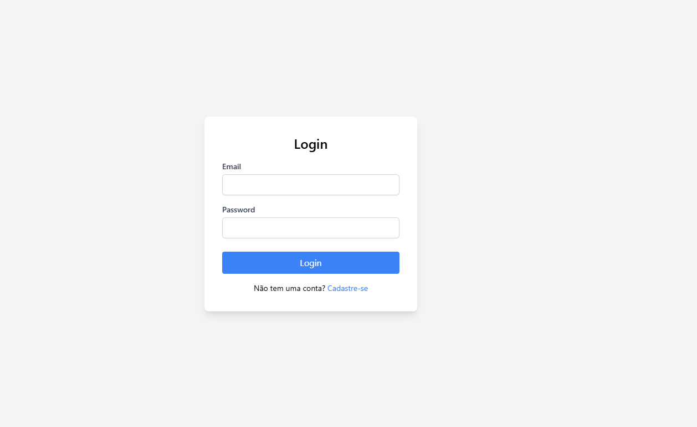
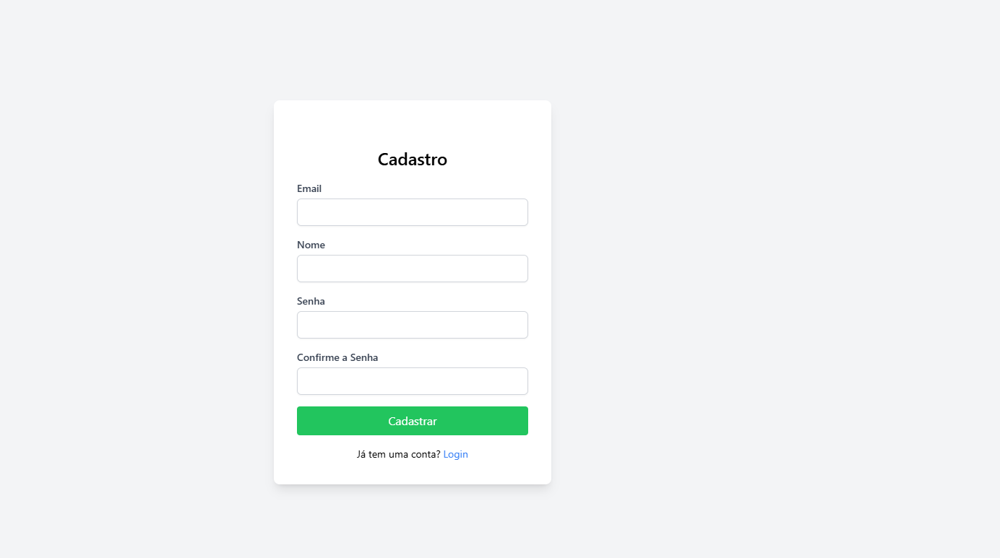
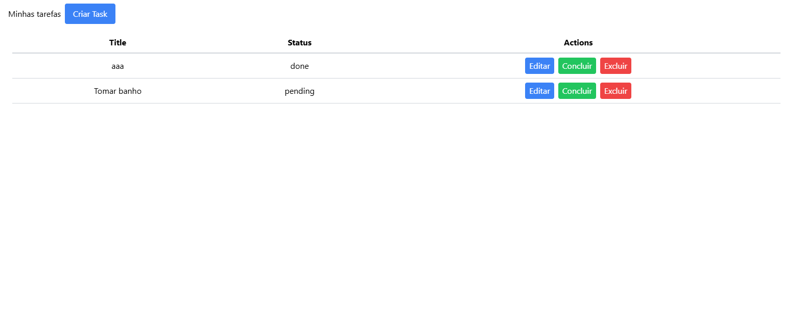
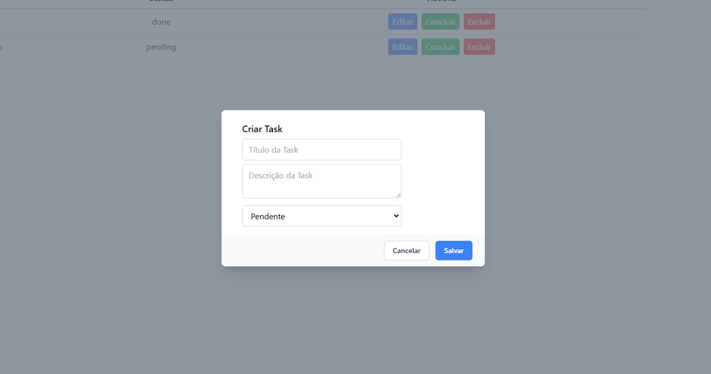

# Always TODO
Always TODO é um aplicativo de gerenciamento de tarefas que permite aos usuários criar, gerenciar e acompanhar suas listas de afazeres. O aplicativo inclui autenticação de usuários para garantir que os dados de cada usuário estejam seguros e privados. Além disso, possui validações de entrada para manter a integridade dos dados e proporcionar uma experiência de usuário suave.

## Interface

